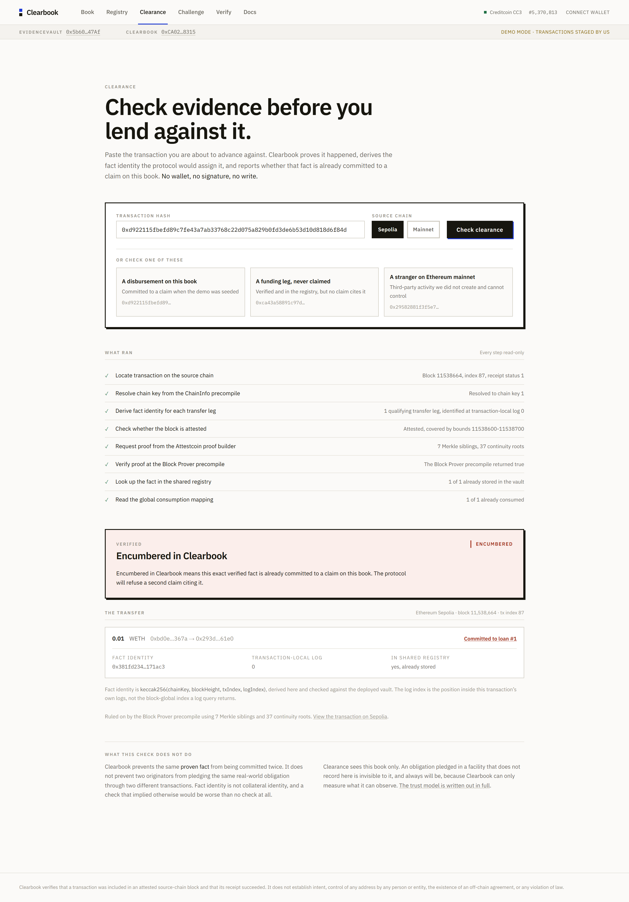

# Clearbook

**Attestcoin makes an external event provable. Clearbook makes a proven event committable once — across independent originators on this book.**

Evidence-exclusivity infrastructure for credit, deployed on Creditcoin CC3 testnet. Every claim on the book cites a source-chain
transfer that was proven on-chain by the Attestcoin Block Prover precompile, no
single verified transfer can back two claims across any originator, and any
covenant breach can be proven and enforced by anyone.

<!-- TODO before submitting: add the demo video link here once recorded (28 Aug).
     Format:  **[3-minute demo](URL)** ·                                        -->

**[Live app](https://clearbook-sable.vercel.app)** ·
**[Attestcoin integration](docs/ATTESTCOIN_INTEGRATION.md)** ·
**[What it does and does not prove](OVERVIEW.md#part-6--what-it-cannot-do)**



---

## The problem

Lenders keep their own books, so the same payment can be shown to two different
lenders as backing for two different loans and neither can tell.

In early 2026 the UK bridging lender **Market Financial Solutions** collapsed.
Over **£2 billion** of lending exposure became entangled across banks and credit
funds, Barclays among them, after court proceedings surfaced allegations that the
same property assets had been pledged multiple times. Judges cited collateral
verification failures within the lending chain. Multiple lenders each believed
they held a senior claim on the same assets.

It was possible because verification was off-chain, fragmented and trust-based
rather than mathematically enforced.

Clearbook does not claim to solve that in general. It makes the specific class of
evidence it *can* verify single-use across a shared registry, and it states
exactly where that boundary sits.

---

## Proof is not enough

Attestcoin answers one question completely: **did this transaction happen?**
Two questions survive that answer, and a book closing neither is not usable as
credit evidence no matter how sound each individual proof is.

| Gap | The question | Mechanism |
|---|---|---|
| **Omission** | Were the relevant payments exposed at all? | **Coverage** |
| **Reuse** | Has this evidence already been committed? | Global **`factConsumedBy`** |

**Omission** is the subtler one. Whoever submits proofs chooses which proofs to
submit, and every one of them verifies. A book can be composed entirely of true
facts and still be a lie by selection. Clearbook cannot prevent that, so it
measures it.

**Reuse** is the one nothing else closes. A verified transfer is evidence, and
evidence can be presented twice. Proving a payment happened says nothing about
whether another lender is already relying on it.

These are not two features. They are the two ways evidence-backed credit fails,
and the product is the pair.

---

## The mechanism

```
An ERC-20 transfer happens on Ethereum      a token we don't control
        ▼
Attestors attest the finalized block        ~8-10 minutes
        ▼
Merkle inclusion + continuity proof
        ▼
Block Prover precompile verifies it         on Creditcoin, 0.8s
        ▼
Receipt decoded on-chain, receiptStatus == 1 asserted
        ▼
TransferFact stored                          immutable, readable by anyone
        ▼
A claim commits it                           once, and only once
        ▼
Covenant evaluated over it                   11 conditions
        ▼
Anyone can challenge                         bond slashed, challenger paid
```

Each step refuses to proceed if the one before it cannot be established.

---

## See it refuse

The landing page does not describe the guarantee. It runs it.

A verified transfer that already backs a claim is held on the page, and the
deployed contract is asked whether a **different** originator could commit that
same evidence. The answer that comes back is `FactAlreadyUsed`, and it is the
contract's, not ours: the call runs as the second originator's own owner account,
and if the guard were removed the panel would report that it failed to fire. No
wallet, no signature, no setup.

Underneath, optionally, you can have that exact attempt broadcast as a real
transaction with the gas sponsored — still no wallet. It is mined and reverts,
receipt status 0, and the fact stays committed to the claim that had it. The
endpoint takes no transaction parameters from the request and simulates before
sending, broadcasting only when the contract already refuses.

One fact, one claim — and that holds across independent originators sharing this
book, not merely within a single claim.

## An identity no claimant can forge

This is the part worth reading if you read nothing else.

A fact's identity is:

```solidity
factId = keccak256(abi.encode(chainKey, blockHeight, txIndex, logIndex))
```

and `factConsumedBy[factId]` is a **single global mapping**, not one scoped per
originator, which is what makes a fact committed by one institution visibly
unavailable to every other.

Now look at where `txIndex` comes from
([`EvidenceVault.sol:67`](contracts/src/EvidenceVault.sol#L67)):

```solidity
// 2. txIndex comes from the precompile, never from the caller.
uint64 txIndex = VERIFIER.calculateTxIndex(merkleProof);
```

The Attestcoin precompile recovers the transaction's ordinal position from the
**left/right laterality of the merkle authentication path**. It is not supplied by
the submitter and not read from an RPC.

**The consequence, and it is a closed set.** No part of the identity can be
freely asserted: `txIndex` is recovered from the proof and cannot be supplied,
`chainKey` and `blockHeight` are rejected by the precompile if they do not match
the proof, and `logIndex` must address a real transfer inside the verified
receipt. A caller who could choose `txIndex` would mint unlimited distinct
identities for one transfer and commit each to a different claim. The
one-fact-one-claim guarantee would not weaken. It would collapse.

**Attestcoin is not Clearbook's data source. It is the security anchor of
Clearbook's core invariant.**

Two further details that are easy to get wrong and fatal if you do:

- **`chainKey` is not the EVM chain id.** Resolved from the ChainInfo precompile at runtime, never hardcoded. They collide at `1` while meaning different chains: chainKey 1 is Sepolia, chainKey 3 is Ethereum Mainnet.
- **`logIndex` is transaction-local**, the position inside that transaction's own log array, not the block-global index `eth_getLogs` returns. The vault indexes `receipt.receiptLogs[logIndex]` on a decoded receipt.

Full detail: [`docs/ATTESTCOIN_INTEGRATION.md`](docs/ATTESTCOIN_INTEGRATION.md).

---

## Clearance: check evidence before you lend against it

Paste a transaction. Clearbook proves it happened, derives the identity the
protocol would assign each transfer leg, and reports whether that fact is already
committed to a claim. **No wallet, no signature, no write.**

| Outcome | Meaning |
|---|---|
| **Clear in Clearbook** | Verified, and no fact it carries is consumed by a claim on this book |
| **Encumbered in Clearbook** | At least one verified fact here is already committed. The protocol will refuse a second claim citing it |
| **Unverifiable** | No answer can be given, and the exact reason is named |

Three rules are enforced in code, not left to the author:

1. **The verdict never renders without its scope.** "Clear" alone would be read as "this collateral is safe", which Clearbook cannot know.
2. **Every failure returns unverifiable, never clear.** A check that degraded to "clear" when its prover was down would be confidently wrong exactly when its infrastructure had failed. `npm run gate11` asserts this for every failure path.
3. **Every transfer leg is checked**, and any encumbered leg encumbers the transaction.

---

## Covenants and permissionless enforcement

An originator publishes a rule up front and posts a bond against it.
`CIRCULAR_REPAYMENT` says a repayment must not come from money the originator's
own treasury just sent the borrower. Eleven conditions, evaluated on-chain.

Anyone who can prove a breach using verified facts takes **half the slashed
bond**; the other half is burned. No committee, no dispute period, no appeal.

A **reference challenger** runs autonomously: it read the book, evaluated the
covenant and challenged a live claim **15 blocks** after it was made, unprompted.
It holds no privileged role, its address is disclosed in the interface, and
anything it did a stranger could do.

---

## Coverage

The obvious objection to any evidence-bound book is that an originator simply
does not register the activity it would rather nobody looked at. Clearbook cannot
prevent that. It measures it.

```
coverage = committed / qualifying
```

A ratio with a stated denominator and an explicit scope. Never a score, never
colour-graded, and never rendered without its denominator beside it.

---

## What is deployed

| Contract | Address (Creditcoin CC3, chainId 102031) |
|---|---|
| `EvidenceVault` | [`0x5b6048C74165237fF4A8A3cfe1d38E6fE7b547Af`](https://creditcoin-testnet.blockscout.com/address/0x5b6048C74165237fF4A8A3cfe1d38E6fE7b547Af) |
| `Clearbook` | [`0xCA02D51722947d7a93EDBe398498667bab368315`](https://creditcoin-testnet.blockscout.com/address/0xCA02D51722947d7a93EDBe398498667bab368315) |

Precompiles consumed: Block Prover `0x…0FD2`, ChainInfo `0x…0fd3`.

**Real Ethereum mainnet evidence:** a 10,506.42 USDC transfer between two
strangers at block 25,811,720, verified and stored. We deployed nothing on
Ethereum; the tokens are canonical and we control neither address.

---

## Testing and reproducibility

**110 tests across 8 suites**, all passing. Five invariants at 64 × 4,096 calls
each, plus a permanent guard asserting the fuzzer actually reaches `challenge()`
. An earlier version passed every invariant while never entering the interesting
states.

Coverage of `src/`: **100.00% lines** (175/175), **100.00% functions** (20/20),
96.85% statements, 246/254, and **85.71% branches** (54/63). Branch coverage is
published rather than omitted. Reproduce with `forge coverage --ir-minimum`;
plain `forge coverage` cannot compile this tree because disabling `viaIR`
triggers stack-too-deep in the official decoder.

**16 Playwright end-to-end tests** walk the judge journey against the real
deployment, run across desktop and mobile profiles for 28 executions. No mocks,
and no test skips silently: `npm run e2e`.

Integration gates, none permitted to skip on missing configuration:

```bash
npm run gate2    # prove a transaction, verify at the precompile
npm run gate7    # mutate a valid proof six ways; all six rejected
npm run gate8a   # worker crash safety
npm run gate9    # the reference challenger, end to end
npm run gate10   # coverage, cross-checked by a second implementation
npm run gate11   # clearance identity and fail-closed behaviour
```

Measured, not quoted: **~8–10 min** broadcast to usable evidence, **0.8s** for
`verify()`, **160k–224k gas** to submit a fact across 16 real submissions (it
scales with continuity-root count), **15.0s** CC3 block time over a 500-block
sample.

---

## What Clearbook does NOT prove

Stated here rather than buried, because a check that implied more than it
delivers would be worse than no check.

- **Fact identity is not collateral identity.** Clearbook prevents the same *proven fact* from being committed twice. It does **not** prevent two originators pledging the same real-world obligation through two *different* transactions.
- **Coverage sees only bound treasuries.** An originator operating from an address it never declared is outside the denominator.
- **Clearance sees this book only.** An obligation pledged in a facility that does not record here is invisible to it.
- **Absence is unprovable.** Merkle inclusion proofs cannot show something did not happen. Clearbook never certifies a book as clean; it makes specific claims refutable.
- **An address is not an entity.** A bound treasury is an address that produced a signature.
- **The covenant is bounded.** Depth-1 by construction. A legitimate second tranche is challengeable because the rule tests shape, not intent, pinned in `CovenantSemantics.t.sol` rather than papered over.
- **Testnet economics.** Bonds are testnet CTC.

Full list: [`OVERVIEW.md`](OVERVIEW.md) Part 6.

---

## Running it

```bash
npm install
cp .env.example .env          # RPCs and throwaway keys only

cd contracts && forge test    # 110 tests
cd frontend  && npm run dev   # http://localhost:3000

npm run demo:status           # is the book presentable right now?
npm run clearance:check       # run the Clearance path from a terminal
```

Stack: Solidity 0.8.28 with `via_ir`, Foundry, Next.js 16, wagmi, viem,
Tailwind 4. No backend and no database, every figure in the UI is a chain read
in the browser. The single server route is a CORS proxy to the proof builder that
holds no secrets and signs nothing.

---

## Why Creditcoin

Creditcoin is the only chain where a smart contract can natively verify an
Ethereum transaction and then act on it, without a bridge and without a
centralized oracle. Clearbook needs exactly that: the verification must happen
where the credit logic executes, because the identity the verification produces
*is* what the credit logic keys on.
