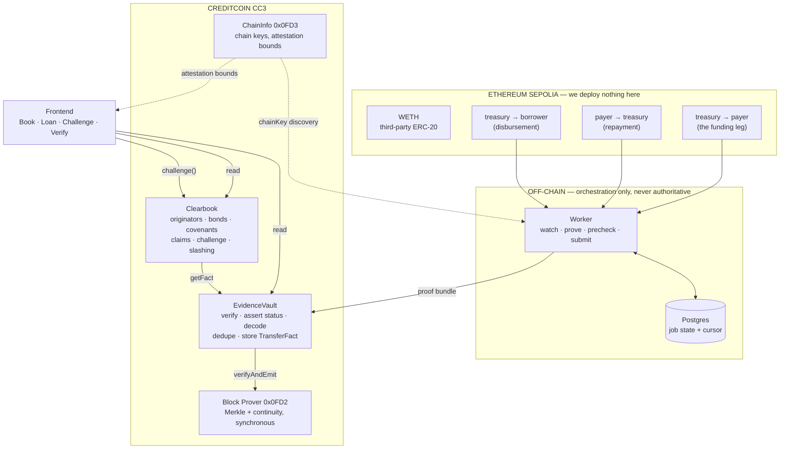
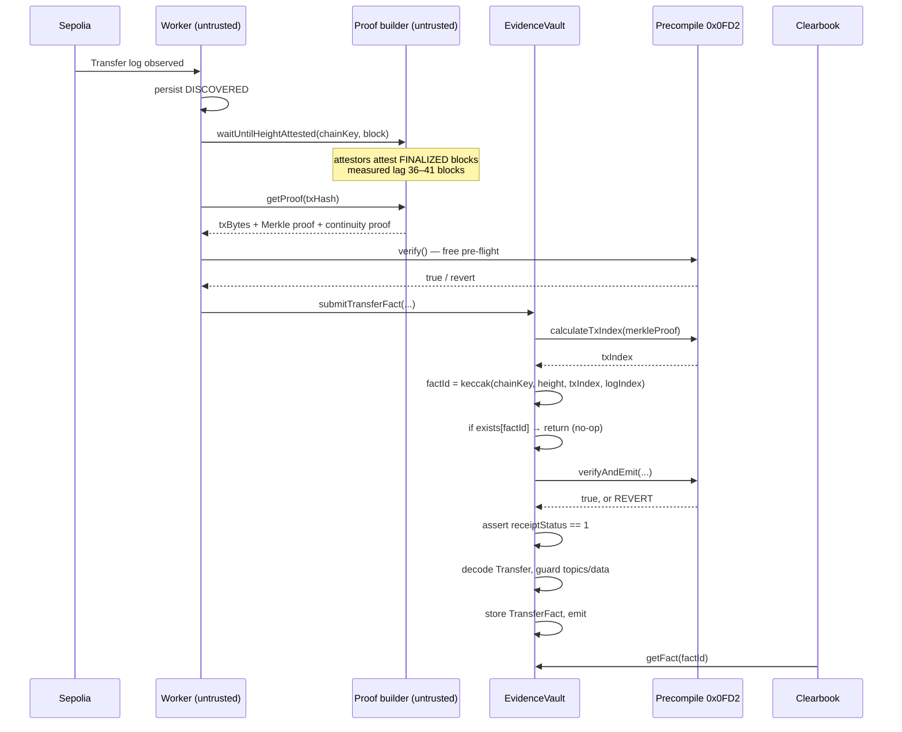
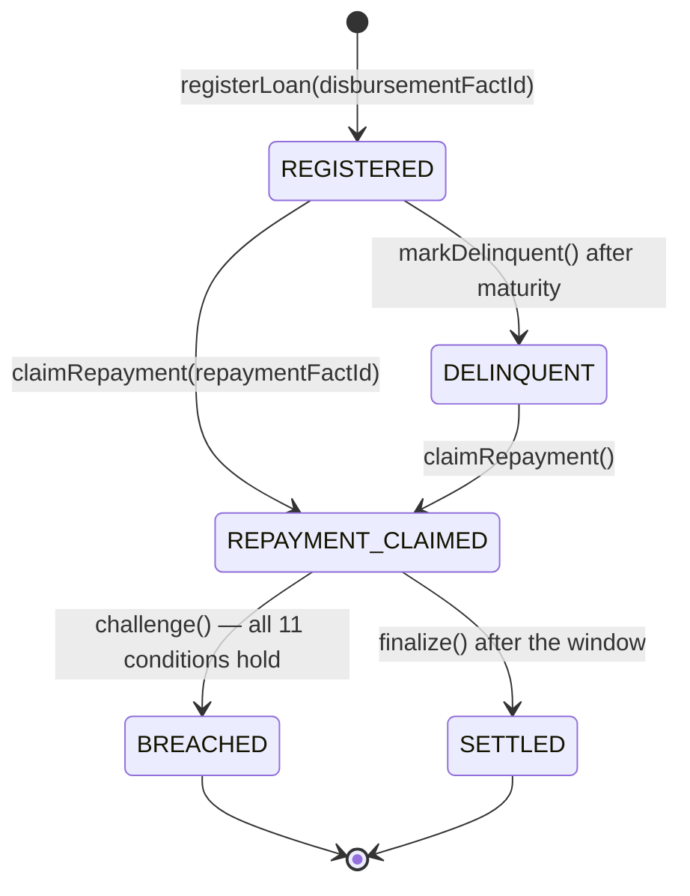
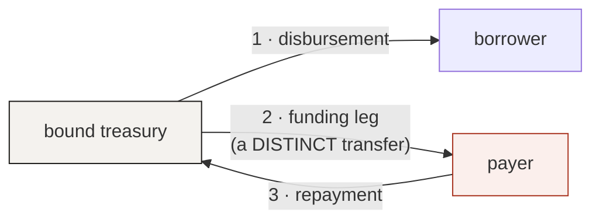

# Architecture

Two contracts on Creditcoin, nothing on the source chain, and one untrusted worker.

---

## The shape of it



The arrow that matters is `EvidenceVault → 0x0FD2`. Everything else is plumbing; that call is what turns a stranger's bytes into a fact the contract will slash money over.

---

## Evidence lifecycle



Two properties are visible in that ordering and both are deliberate.

**Dedupe precedes verification.** Re-submitting a known fact costs almost nothing and changes nothing, which is what makes the worker restart-safe.

**Verification precedes decoding.** Unverified bytes are never decoded into anything consequential.

---

## Loan state machine



`BREACHED` and `SETTLED` are terminal.

Note there is **no `REGISTERED → BREACHED` edge**, though BUILD.md §4.2's diagram draws one. The predicate opens by reading the loan's repayment fact, and a `REGISTERED` loan has none — so challenging one is structurally impossible rather than merely disallowed. §5.3's condition 1 is the authority here; see DECISIONS D-022.

---

## Trust boundary

```
UNTRUSTED   worker · frontend · RPC providers · proof builder ·
            originator · borrower · challenger · all user input
SEMI-TRUST  Attestcoin attestor quorum · Creditcoin validators
TRUSTED     Ethereum finality · Creditcoin consensus · the 0x0FD2 implementation
```

**The worker cannot lie.** It acquires bundles and pays gas. A corrupted bundle fails verification and the transaction reverts — measured, not asserted: six deliberate mutations were all rejected by the precompile (DECISIONS D-041). Delete the worker and any third party can submit the identical bundle for the same result.

**The proof builder cannot forge.** It supplies proof *material*; the precompile is what makes that material meaningful. It can deny service. It cannot manufacture a fact.

---

## Why two contracts

`EvidenceVault` knows nothing about loans, originators or bonds. It converts a proof into an immutable, deduplicated `TransferFact` and stops there. That separation is not tidiness — it means the vault is a **reusable public primitive** any Creditcoin dApp can consume, and it keeps the component that touches cryptography free of the component that touches money.

`Clearbook` never verifies anything itself. It consumes fact ids and applies rules to them.

No proxy, no upgradeability, no admin key, no pause. The attack surface is the product; an admin key would contradict the trust model the whole design rests on.

---

## The covenant, mechanically

`CIRCULAR_REPAYMENT` asks one question: *was the money that came back the originator's own money going out and returning?*



A challenge cites legs 2 and 3. Leg 2 must be **distinct from the disbursement** — condition 11 — because otherwise every honest loan would look circular: a genuine loan is always `treasury → borrower … borrower → treasury`.

That single condition is what separates the two demo scenarios. Scenario A's borrower was never separately funded, so the only `treasury → borrower` transfer is the disbursement itself, and citing it fails condition 11. Scenario B has a genuine second transfer, and it breaches.

The eleven conditions are enumerated in `SECURITY.md` and implemented in `CovenantLib.requireCircularRepaymentBreach` plus the two distinctness checks in `Clearbook.challenge`.

---

## What the frontend does and does not trust

The UI reads contract state directly through viem. It keeps no database and derives no facts.

Its one genuinely clever piece is the **client-side dry run**: `lib/predicate.ts` mirrors all eleven conditions so a challenger sees pass/fail *before* a wallet opens. This is a preview, never an authority — the contract re-evaluates every condition on-chain, and if the two ever disagree the chain is right and the mirror is a bug. `npm run check:predicate` asserts the mirror against every demo scenario for exactly this reason.

The one thing the UI cannot read from contract state is a fact's **source-chain transaction hash**: `TransferFact` stores coordinates (`chainKey`, `blockHeight`, `txIndex`, `logIndex`), not a hash. The hash exists only in the `TransferFactStored` event, which is why `worker/src/index.ts` projects it. Where that projection is unavailable, the UI shows the coordinates it genuinely has rather than inventing a hash.

---

## Repository map

```
contracts/src/     EvidenceVault · Clearbook · CovenantLib · IEvidenceVault
contracts/test/    110 tests — unit, security, invariants, deploy guards
contracts/script/  Deploy.s.sol with production guards
integration/       gate0 · gate0-lag · gate1 · gate1a · gate2/3 · gate7 · measure-latency
worker/src/        discover · watch · prove · precheck · submit · db · log · health · main · index
frontend/          Next.js — Book · Loan · Challenge · Verify
demo/              stage-source · prove-staged · staged/
docs/              ARCHITECTURE · ATTESTCOIN_INTEGRATION · THREAT_MODEL · LATENCY
```
